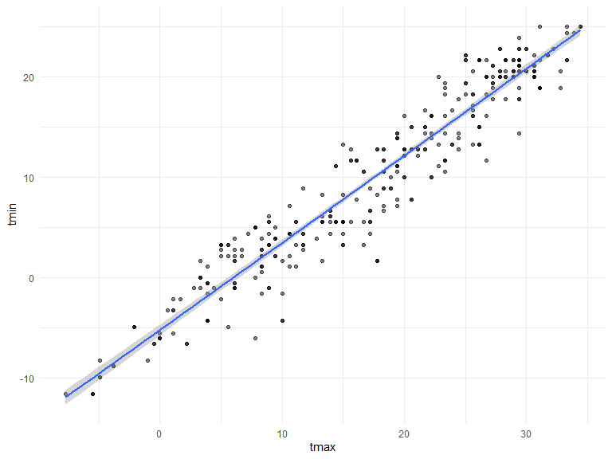

p8105\_hw6\_kmw2189
================
Kylie Wheelock Riley
11/25/2019

## Problem 1

**Loading and tidying data**

``` r
## load in data
birthweight_df = read_csv("data/birthweight.csv") %>% 
  janitor::clean_names()
```

    ## Parsed with column specification:
    ## cols(
    ##   .default = col_double()
    ## )

    ## See spec(...) for full column specifications.

``` r
## checking for missings, etc.
skimr::skim(birthweight_df)
##there appear to be no missings for any of the the variables, yay!
```

``` r
##changing the var type for babysex, mrace, and frace
birthweight_df = birthweight_df %>% 
  mutate(
  sex = as.factor(babysex),
  sex = recode(sex, "1" = "male", "2" = "female" ),
  m_race = as.character(mrace),
  m_race = recode(mrace, "1" = "White", "2" = "Black", "3" = "Asian", "4" = "Puerto Rican", "8" = "Other"),
  f_race = as.character(frace),
  f_race = recode(frace, "1" = "White", "2" = "Black", "3" = "Asian", "4" = "Puerto Rican", "8" = "Other", "9" = "Unknown")
  ) %>% 
  select(-babysex, -mrace, -frace) %>% 
  select(sex, everything()) 
```

**Model fitting**

From my experience working with birth outcomes, specifically
birthweight, there are 3 covariates that are necessary to include in the
model: gestational age, maternal BMI, and a socioeconomic status (SES)
indicator. For this model I will use family income as the SES indicator.

``` r
birthwt_mdl_1 = lm(bwt ~ gaweeks + ppbmi + fincome, data = birthweight_df)
```

``` r
##plot of model residuals against fitted values
birthweight_df %>% 
  modelr::add_residuals(birthwt_mdl_1) %>% 
  modelr::add_predictions(birthwt_mdl_1) %>% 
  ggplot(aes(x = pred, y = resid)) + 
  geom_point(alpha = 0.5) +
  labs(
      title = "Model 1 residuals against predicted values",
      x = "Predicted Values",
      y = "Residuals",
      caption = "Summary of predicted values from a model of birthweight by the residuals of the model"
  )
```


Compare your model to two others:

One using length at birth and gestational age as predictors (main
effects only)

``` r
birthwt_mdl_2 = lm(bwt ~ gaweeks + blength, data = birthweight_df) 
```

One using head circumference, length, sex, and all interactions
(including the three-way interaction) between these

``` r
birthwt_mdl_3 = lm(bwt ~ bhead + blength + sex + bhead*blength + bhead*sex + blength*sex + bhead*blength*sex, data = birthweight_df) 
```

**Comparing Models**

Make this comparison in terms of the cross-validated prediction error;
use crossv\_mc and functions in purrr as appropriate.

``` r
##Plotting predicted birthweight values against the true birthwight values for each model
birthweight_df %>% 
  gather_predictions(birthwt_mdl_1, birthwt_mdl_2, birthwt_mdl_3) %>% 
  mutate(model = fct_inorder(model)) %>% 
  ggplot(aes(x = bwt, y = pred))  + 
  geom_point() + 
  ##geom_line(aes(y = pred), color = "red") + 
  facet_wrap(~model)
```


``` r
##create the training and testing datasets using modelr
cv_df =
  crossv_mc(birthweight_df, 100)

##use mutate + map & map2 to fit models to training data and obtain corresponding RMSEs for the testing data
cv_df = 
  cv_df %>% 
  mutate(
    birthwt_mdl_1 = map(train, ~lm(bwt ~ gaweeks + ppbmi + fincome, data = .x)), 
    birthwt_mdl_2 = map(train, ~lm(bwt ~ gaweeks + blength, data = .x)),
    birthwt_mdl_3 = map(train, ~lm(bwt ~ bhead + blength + sex + bhead*blength + bhead*sex + blength*sex + bhead*blength*sex, data = as_tibble(.x)))
    ) %>% 
  mutate(
    rmse_mdl_1 = map2_dbl(birthwt_mdl_1, test, ~rmse(model = .x, data = .y)),
    rmse_mdl_2 = map2_dbl(birthwt_mdl_2, test, ~rmse(model = .x, data = .y)),
    rmse_mdl_3 = map2_dbl(birthwt_mdl_3, test, ~rmse(model = .x, data = .y))
    )
```

``` r
##plotting rmse for each model
cv_df %>% 
  select(starts_with("rmse")) %>% 
pivot_longer(
    everything(),
    names_to = "model", 
    values_to = "rmse",
    names_prefix = "rmse_") %>% 
  mutate(model = fct_inorder(model)) %>% 
  ggplot(aes(x = model, y = rmse)) + 
  geom_violin() +
  labs(
      title = "RMSEs for each model",
      x = "Model",
      y = "RMSE",
      caption = "Evaluating the best fit of models predicting birthweight"
  )
```


**Conclusion**

My initially predicted model using gestational age, maternal BMI, and
income as an SES measure did not perform nearly as well as I
anticipated\! Model 3, or the “fully loaded” model containing head
circumference, birth length and sex interactions performed the best. If
I were to revise my original model I would definitely include birth
length.

## Question 2

Use 5000 bootstrap samples and, for each bootstrap sample, produce
estimates of these two quantities. Plot the distribution of your
estimates, and describe these in words. Using the 5000 bootstrap
estimates, identify the 2.5% and 97.5% quantiles to provide a 95%
confidence interval for r^2 and log(β<sup>0∗β</sup>1).

**Step One:**

Load data and look at plot.

``` r
weather_df = 
  rnoaa::meteo_pull_monitors(
    c("USW00094728"),
    var = c("PRCP", "TMIN", "TMAX"), 
    date_min = "2017-01-01",
    date_max = "2017-12-31") %>%
  mutate(
    name = recode(id, USW00094728 = "CentralPark_NY"),
    tmin = tmin / 10,
    tmax = tmax / 10) %>%
  select(name, id, everything())
```

    ## Registered S3 method overwritten by 'crul':
    ##   method                 from
    ##   as.character.form_file httr

    ## Registered S3 method overwritten by 'hoardr':
    ##   method           from
    ##   print.cache_info httr

    ## file path:          C:\Users\lifeo\AppData\Local\rnoaa\rnoaa\Cache/ghcnd/USW00094728.dly

    ## file last updated:  2019-11-03 22:01:50

    ## file min/max dates: 1869-01-01 / 2019-11-30

``` r
##graph data
weather_df %>% 
  ggplot(aes(x = tmax, y = tmin)) + 
  geom_point(alpha = .5) +
  stat_smooth(method = "lm") 
```


**Step 2:**

Generate the bootstrap data.

``` r
## one bootstrap
boot_sample = function(df) {
  sample_frac(df, replace = TRUE)
}

## check plot
boot_sample(weather_df) %>% 
  ggplot(aes(x = tmax, y = tmin)) + 
  geom_point(alpha = .5) +
  stat_smooth(method = "lm")
```



``` r
##graph looks similar, but you can tell the points are slightly different. 

## all the bootstraps
boot_straps = 
  data_frame(
    strap_number = 1:5000,
    strap_sample = rerun(5000, boot_sample(weather_df))
  )
```

**Step 3:**

Creating a simple linear regression with tmax as the response and tmin
as the predictor

``` r
prob_2_reg = lm(tmax ~ tmin, data = weather_df)
```

**Step 4:**

Generate the r^2 and log(β<sup>0∗β</sup>1) values to use for the 2.5%
and 97.5% confidence intervals.

``` r
##use broom::glance to get the rsquared info
prob_2_reg %>% 
  broom::glance()
```

    ## # A tibble: 1 x 11
    ##   r.squared adj.r.squared sigma statistic   p.value    df logLik   AIC
    ##       <dbl>         <dbl> <dbl>     <dbl>     <dbl> <int>  <dbl> <dbl>
    ## 1     0.912         0.911  2.94     3741. 2.98e-193     2  -910. 1827.
    ## # ... with 3 more variables: BIC <dbl>, deviance <dbl>, df.residual <int>

``` r
## use broom::tidy() (with some additional wrangling) to compute log(β^0∗β^1)
prob_2_reg %>% 
  broom::tidy()
```

    ## # A tibble: 2 x 5
    ##   term        estimate std.error statistic   p.value
    ##   <chr>          <dbl>     <dbl>     <dbl>     <dbl>
    ## 1 (Intercept)     7.21    0.226       31.8 3.81e-107
    ## 2 tmin            1.04    0.0170      61.2 2.98e-193
