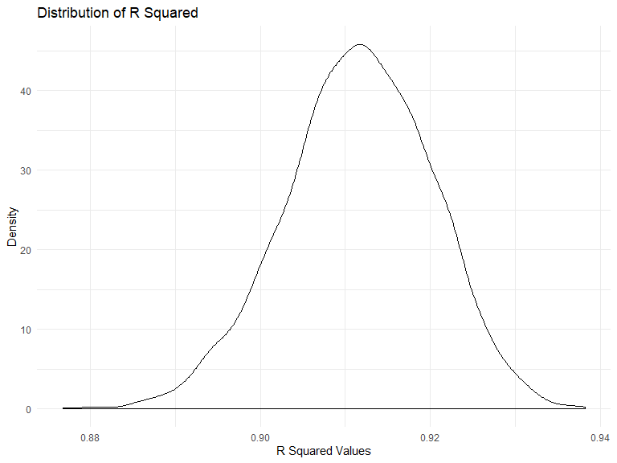

p8105\_hw6\_kmw2189
================
Kylie Wheelock Riley
11/25/2019

## Problem 1

``` r
## load in data
birthweight_df = read_csv("data/birthweight.csv") %>% 
  janitor::clean_names()
```

    ## Parsed with column specification:
    ## cols(
    ##   .default = col_double()
    ## )

    ## See spec(...) for full column specifications.

``` r
## checking for missings, etc.
skimr::skim(birthweight_df)
```

    ## Skim summary statistics
    ##  n obs: 4342 
    ##  n variables: 20 
    ## 
    ## -- Variable type:numeric --------------------------------------
    ##  variable missing complete    n      mean      sd     p0     p25     p50
    ##   babysex       0     4342 4342    1.49     0.5     1       1       1   
    ##     bhead       0     4342 4342   33.65     1.62   21      33      34   
    ##   blength       0     4342 4342   49.75     2.72   20      48      50   
    ##       bwt       0     4342 4342 3114.4    512.15  595    2807    3132.5 
    ##     delwt       0     4342 4342  145.57    22.21   86     131     143   
    ##   fincome       0     4342 4342   44.11    25.98    0      25      35   
    ##     frace       0     4342 4342    1.66     0.85    1       1       2   
    ##   gaweeks       0     4342 4342   39.43     3.15   17.7    38.3    39.9 
    ##   malform       0     4342 4342    0.0035   0.059   0       0       0   
    ##  menarche       0     4342 4342   12.51     1.48    0      12      12   
    ##   mheight       0     4342 4342   63.49     2.66   48      62      63   
    ##    momage       0     4342 4342   20.3      3.88   12      18      20   
    ##     mrace       0     4342 4342    1.63     0.77    1       1       2   
    ##    parity       0     4342 4342    0.0023   0.1     0       0       0   
    ##   pnumlbw       0     4342 4342    0        0       0       0       0   
    ##   pnumsga       0     4342 4342    0        0       0       0       0   
    ##     ppbmi       0     4342 4342   21.57     3.18   13.07   19.53   21.03
    ##      ppwt       0     4342 4342  123.49    20.16   70     110     120   
    ##    smoken       0     4342 4342    4.15     7.41    0       0       0   
    ##    wtgain       0     4342 4342   22.08    10.94  -46      15      22   
    ##      p75   p100     hist
    ##     2       2   <U+2587><U+2581><U+2581><U+2581><U+2581><U+2581><U+2581><U+2587>
    ##    35      41   <U+2581><U+2581><U+2581><U+2581><U+2585><U+2587><U+2581><U+2581>
    ##    51      63   <U+2581><U+2581><U+2581><U+2581><U+2581><U+2587><U+2581><U+2581>
    ##  3459    4791   <U+2581><U+2581><U+2581><U+2583><U+2587><U+2587><U+2582><U+2581>
    ##   157     334   <U+2581><U+2587><U+2585><U+2581><U+2581><U+2581><U+2581><U+2581>
    ##    65      96   <U+2581><U+2582><U+2587><U+2582><U+2582><U+2582><U+2581><U+2583>
    ##     2       8   <U+2587><U+2587><U+2581><U+2581><U+2581><U+2581><U+2581><U+2581>
    ##    41.1    51.3 <U+2581><U+2581><U+2581><U+2581><U+2583><U+2587><U+2581><U+2581>
    ##     0       1   <U+2587><U+2581><U+2581><U+2581><U+2581><U+2581><U+2581><U+2581>
    ##    13      19   <U+2581><U+2581><U+2581><U+2581><U+2582><U+2587><U+2581><U+2581>
    ##    65      77   <U+2581><U+2581><U+2581><U+2585><U+2587><U+2582><U+2581><U+2581>
    ##    22      44   <U+2582><U+2587><U+2585><U+2582><U+2581><U+2581><U+2581><U+2581>
    ##     2       4   <U+2587><U+2581><U+2587><U+2581><U+2581><U+2581><U+2581><U+2581>
    ##     0       6   <U+2587><U+2581><U+2581><U+2581><U+2581><U+2581><U+2581><U+2581>
    ##     0       0   <U+2581><U+2581><U+2581><U+2587><U+2581><U+2581><U+2581><U+2581>
    ##     0       0   <U+2581><U+2581><U+2581><U+2587><U+2581><U+2581><U+2581><U+2581>
    ##    22.91   46.1 <U+2581><U+2587><U+2585><U+2581><U+2581><U+2581><U+2581><U+2581>
    ##   134     287   <U+2581><U+2587><U+2586><U+2581><U+2581><U+2581><U+2581><U+2581>
    ##     5      60   <U+2587><U+2581><U+2581><U+2581><U+2581><U+2581><U+2581><U+2581>
    ##    28      89   <U+2581><U+2581><U+2581><U+2587><U+2587><U+2581><U+2581><U+2581>

``` r
##there appear to be no missings for any of the the variables, yay!
```

``` r
##changing the var type for babysex, mrace, and frace
birthweight_df = birthweight_df %>% 
  mutate(
  sex = as.factor(babysex),
  sex = recode(sex, "1" = "male", "2" = "female" ),
  m_race = as.character(mrace),
  m_race = recode(mrace, "1" = "White", "2" = "Black", "3" = "Asian", "4" = "Puerto Rican", "8" = "Other"),
  f_race = as.character(frace),
  f_race = recode(frace, "1" = "White", "2" = "Black", "3" = "Asian", "4" = "Puerto Rican", "8" = "Other", "9" = "Unknown")
  ) %>% 
  select(-babysex, -mrace, -frace) %>% 
  select(sex, everything()) 
```

**Model fitting**

From my experience working with birth outcomes, specifically
birthweight, there are 3 covariates that are absolutely necessary to
include in the model: gestational age, maternal BMI, and a socioeconomic
status indicator. For this model I will use family income as the SES
indicator.

``` r
birthwt_mdl_1 = lm(bwt ~ gaweeks + ppbmi + fincome, data = birthweight_df) 

birthwt_mdl_1 %>% 
  broom::tidy() 
```

    ## # A tibble: 4 x 5
    ##   term        estimate std.error statistic   p.value
    ##   <chr>          <dbl>     <dbl>     <dbl>     <dbl>
    ## 1 (Intercept)   173.      98.7        1.76 7.93e-  2
    ## 2 gaweeks        64.6      2.23      28.9  2.68e-168
    ## 3 ppbmi          13.7      2.20       6.24 4.73e- 10
    ## 4 fincome         2.25     0.271      8.28 1.61e- 16

``` r
birthweight_df %>% 
  modelr::add_residuals(birthwt_mdl_1) %>% 
  modelr::add_predictions(birthwt_mdl_1) %>% 
  ggplot(aes(x = pred, y = resid)) + geom_point()
```



Compare your model to two others:

One using length at birth and gestational age as predictors (main
effects only)

``` r
birthwt_mdl_2 = lm(bwt ~ gaweeks + blength, data = birthweight_df) 

birthwt_mdl_2 %>% 
  broom::tidy() 
```

    ## # A tibble: 3 x 5
    ##   term        estimate std.error statistic  p.value
    ##   <chr>          <dbl>     <dbl>     <dbl>    <dbl>
    ## 1 (Intercept)  -4348.      98.0      -44.4 0.      
    ## 2 gaweeks         27.0      1.72      15.7 2.36e-54
    ## 3 blength        129.       1.99      64.6 0.

One using head circumference, length, sex, and all interactions
(including the three-way interaction) between these

``` r
birthwt_mdl_3 = lm(bwt ~ bhead + blength + sex + bhead*blength + bhead*sex + blength*sex + bhead*blength*sex, data = birthweight_df) 

birthwt_mdl_3 %>% 
  broom::tidy() 
```

    ## # A tibble: 8 x 5
    ##   term                     estimate std.error statistic      p.value
    ##   <chr>                       <dbl>     <dbl>     <dbl>        <dbl>
    ## 1 (Intercept)             -7177.     1265.       -5.67  0.0000000149
    ## 2 bhead                     182.       38.1       4.78  0.00000184  
    ## 3 blength                   102.       26.2       3.90  0.0000992   
    ## 4 sexfemale                6375.     1678.        3.80  0.000147    
    ## 5 bhead:blength              -0.554     0.780    -0.710 0.478       
    ## 6 bhead:sexfemale          -198.       51.1      -3.88  0.000105    
    ## 7 blength:sexfemale        -124.       35.1      -3.52  0.000429    
    ## 8 bhead:blength:sexfemale     3.88      1.06      3.67  0.000245

I was surprised to find that there were so many

Make this comparison in terms of the cross-validated prediction error;
use crossv\_mc and functions in purrr as appropriate.
